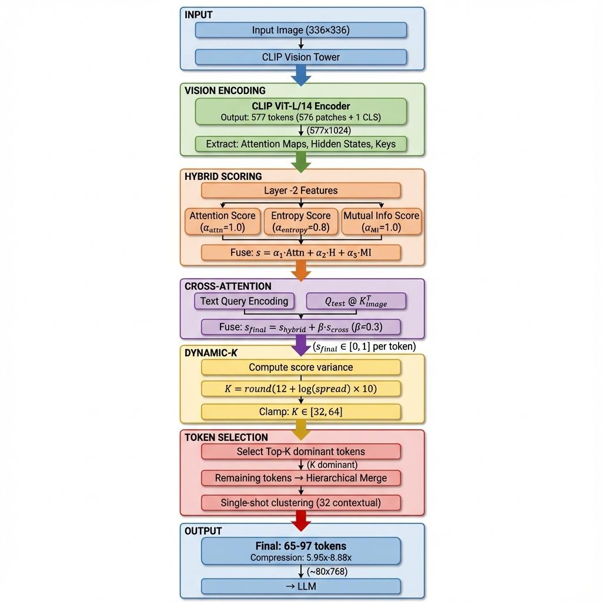

# SparseZip: Text-Aware Visual Token Compression for Efficient VLM Inference

SparseZip is a training-free, plug-and-play vision token compression method for Vision-Language Models (VLMs). It reduces the number of visual tokens processed by the LLM while preserving semantic fidelity through text-aware token selection and hierarchical merging.

## Key Results

- **POPE Accuracy**: 83.7% (vs 85.7% LLaVA baseline, only 2% drop)
- **Latency Reductions**: 
  - POPE: 19.2% reduction (479.987ms vs 594.238ms)
  - MME: 36.2% reduction (199.748ms vs 313.143ms)
  - DocVQA: 11.0% reduction (928.452ms vs 1043.561ms)
- **Efficiency**: Adds ~0.73 GFLOPs overhead (~1/10 of a CLIP layer), saves 244.5 MB GPU memory per image
- **Trade-off**: Achieves best balance between latency and accuracy across all three benchmarks

## Features

- **Hybrid Scoring**: Combines attention, entropy, and mutual information for richer token importance signals
- **Dynamic-K Budgeting**: Adapts token retention per image based on information complexity (K = log(Var(scores)) + c)
- **Hierarchical Merging**: Uses k-means++ and agglomerative clustering to merge non-dominant tokens into contextual representations
- **Training-Free**: No gradients or fine-tuning required, works with pre-trained models

## Quick Start

### Installation

```bash
# Sync git submodules
git submodule update --init --recursive

# Install dependencies
pip install -r requirements_A40.txt  # or requirements_A40_visionzip.txt

# Login to HuggingFace if needed
huggingface-cli login
```

### Smoke Test (Single Image)

Test SparseZip compression on a single image:

```bash
python scripts/quick_start/qs_sparsezip_smoke.py \
  --cfg config/sparsezip_mme.yaml \
  --image reference/owl.JPEG \
  --prompt "Describe the owl briefly." \
  --clip_only   # Remove this flag for full LLaVA generation
```

### Run Evaluation on POPE

```bash
python tools/pope_run_all.py \
  --cfg config/sparsezip_pope.yaml \
  --model_path liuhaotian/llava-v1.5-7b \
  --out_dir ./runs/pope_sparsezip
```

### Run Evaluation on MME (Single Subtask)

```bash
python tools/mme_run_all.py \
  --mme_root /path/to/MME_Benchmark \
  --out_root ./runs/mme_sparsezip \
  --cfg config/sparsezip_mme.yaml \
  --model_type sparsezip \
  --only OCR
```

## How SparseZip Works



SparseZip reduces visual token count through three main steps:

1. **Hybrid Scoring**: Each vision token is scored using a weighted combination of:
   - Self-attention scores (global salience)
   - Feature entropy (local discriminative cues)
   - Mutual information proxy (redundancy detection)

2. **Dynamic-K Selection**: The number of dominant tokens (K) is adapted per image:
   - High-complexity images → higher K
   - Low-complexity images → lower K
   - Formula: `K = round(log(Var(scores) + eps) + c)`, bounded by k_min/k_max

3. **Contextual Merging**: Non-dominant tokens are merged into fewer contextual tokens using:
   - k-means++ initialization
   - Optional agglomerative hierarchical clustering
   - Attention-weighted aggregation

The scoring can be text-aware by using the MM projector's transpose (W^T) to inject text query semantics into the vision space without additional learnable parameters.

## Configuration

SparseZip is configured via YAML files. Example configuration:

```yaml
model:
  model_type: sparsezip
  model_path: liuhaotian/llava-v1.5-7b
  temperature: 0.0
  max_new_tokens: 16

  sparsezip:
    dynamic_k: true
    k_min: 32
    k_max: 64
    dynk:
      c: 12.0
      eps: 1.0e-3

    # Hybrid scoring weights
    alphas:
      attn: 1.0
      entropy: 0.8
      mutual: 1.0
    tau_feat: 0.15
    tau_sim: 0.08
    cross_beta: 0.3  # Text-aware cross-attention weight

    # Contextual merging
    merging:
      contextual_num: 32
      kmeans_init_factor: 2.0
      kmeans_iters: 1
      agglomerative: false
```

See `config/sparsezip_mme.yaml`, `config/sparsezip_pope.yaml`, and `config/sparsezip_docvqa.yaml` for dataset-specific examples.

## Evaluation Framework

This repository provides a modular evaluation framework that supports:

- **Multiple Models**: VisionZip, SparseVLM, SparseZip, and baseline LLaVA
- **Multiple Datasets**: MME, POPE, DocVQA, COCO-Caption
- **Modular Components**: Swap datasets, metrics, or models independently

### Framework Structure

```
scripts/
  dataset.py      # Dataset loaders (MME, POPE, DocVQA)
  metric.py       # Evaluation metrics (accuracy, precision, recall, etc.)
  model.py        # Model wrappers (LlavaModel, LlavaSparseZipModel, etc.)
  evalkit.py      # Unified evaluation orchestrator
  abstract.py     # Base classes for modular components

tools/
  mme_run_all.py  # MME benchmark runner
  pope_run_all.py # POPE benchmark runner
  docvqa_run_all.py # DocVQA runner

config/
  sparsezip_*.yaml  # SparseZip configurations
  sparsevlm_*.yaml  # SparseVLM configurations
  visionzip_*.yaml  # VisionZip configurations
```

### Customizing the Framework

You can customize datasets, metrics, or models by implementing the base classes in `scripts/abstract.py`:

- `BaseDataset`: Implement `__len__` and `__getitem__` returning `Sample` objects
- `BaseMetric`: Implement `update()` and `compute()` methods
- `BaseModel`: Implement `run()` returning predictions and timing info

See the existing implementations in `scripts/dataset.py`, `scripts/metric.py`, and `scripts/model.py` for examples.

## Dataset Setup

### MME Dataset

```bash
# Download MME dataset
python scripts/dataset_download.py --dataset mme --output_dir ./datasets

# Run evaluation
python tools/mme_run_all.py \
  --mme_root ./datasets/mme/MME_Benchmark_release_version/MME_Benchmark \
  --out_root ./eval_results/mme_eval \
  --cfg config/sparsezip_mme.yaml \
  --only OCR  # Optional: limit to specific subtasks
```

### POPE Dataset

POPE annotations are typically generated from COCO val2014. See `tools/pope_run_all.py` for setup details.

## Performance Comparison

### Table 1: SparseZip and Baselines on DocVQA, POPE, and MME

| Model | DocVQA (val) ||| POPE ||||| MME |||
|-------|:---:|:---:|:---:|:---:|:---:|:---:|:---:|:---:|:---:|:---:|:---:|
|       | Latency (ms) ↓ | ANLS ↑ | Exact Match ↑ | Latency (ms) ↓ | Acc. ↑ | F1 ↑ | Prec. ↑ | Rec. ↑ | Latency (ms) ↓ | MME-Acc ↑ | MME-Acc+ ↑ |
| **Llava** | 1043.561 | 0.011 | 0.002 | 594.238 | 0.857 | 0.846 | 0.918 | 0.785 | 313.143 | 0.743 | 0.533 |
| **SparseZip** | **928.452** | **0.010** | **0.002** | **479.987** | **0.837** | **0.816** | **0.940** | **0.721** | **199.748** | **0.722** | **0.492** |
| SparseVLM | 1053.229 | 0.011 | 0.002 | 618.729 | 0.849 | 0.836 | 0.918 | 0.768 | 203.252 | 0.736 | 0.529 |
| VisionZip | 873.286 | 0.009 | 0.001 | 429.646 | 0.798 | 0.758 | 0.943 | 0.634 | 158.775 | 0.705 | 0.462 |

**Key Findings:**

- **POPE**: SparseZip achieves 83.7% accuracy with only 2% drop from Llava baseline (85.7%), while reducing latency by 19.2% (479.987ms vs 594.238ms). SparseZip outperforms VisionZip (79.8%) and is competitive with SparseVLM (84.9%).

- **MME**: SparseZip achieves 36.2% latency reduction (199.748ms vs 313.143ms) while maintaining 72.2% accuracy (vs 74.3% baseline).

- **DocVQA**: SparseZip reduces latency by 11.0% (928.452ms vs 1043.561ms) while maintaining comparable ANLS and exact match scores.

- **Overall**: SparseZip demonstrates strong latency-accuracy trade-offs across all three benchmarks, with significant speedups (11-36% latency reduction) while preserving most accuracy.

## Ablation Components

SparseZip includes several components that can be enabled/disabled:

- **Hybrid Attention**: Multi-signal scoring (attention + entropy + mutual information)
- **Text-Aware Cross-Attention**: Text-conditioned token selection (via MM projector transpose)
- **Dynamic-K**: Adaptive token budgeting (can be disabled for fixed-K)
- **Hierarchical Merging**: Contextual token aggregation (can be simplified or disabled)

Configuration flags: `skip_hybrid_attn`, `skip_dynamic_k`, `skip_ctx_merge` in YAML.

## Technical Details

For detailed implementation information, see:
- `docs/README_SPARSEZIP.md` - Detailed SparseZip documentation
- `utils/sparsezip.py` - Core compression implementation
- `scripts/model.py` - Model integration (LlavaSparseZipModel class)

## Requirements

- Python 3.10+
- PyTorch 2.1.2+
- Transformers library
- CUDA-capable GPU (recommended) or CPU with sufficient RAM
- ~14 GB VRAM for LLaVA-1.5-7B in float16

## Troubleshooting

- **HuggingFace authentication errors**: Run `huggingface-cli login`
- **Out of memory**: Use CPU offloading or reduce batch size
- **macOS issues**: 4/8-bit quantization not available; install `protobuf` for tokenizer
- **Slow inference**: Ensure CUDA is available and model is loaded on GPU

## Citation

If you use SparseZip in your research, please cite:

```bibtex
@article{sparsezip2024,
  title={SparseZip: Text-Aware Visual Token Selection and Compression for Efficient Vision-Language Model Inference},
  author={...},
  year={2024}
}
```

## License

[Add your license information here]

## Acknowledgments

Built on top of LLaVA and integrates with VisionZip and SparseVLM methodologies.
